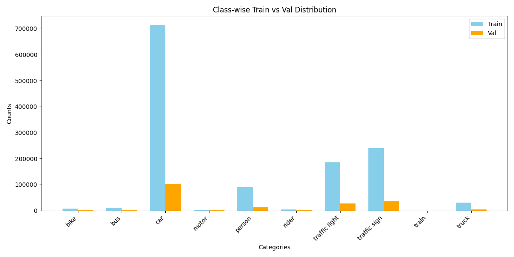
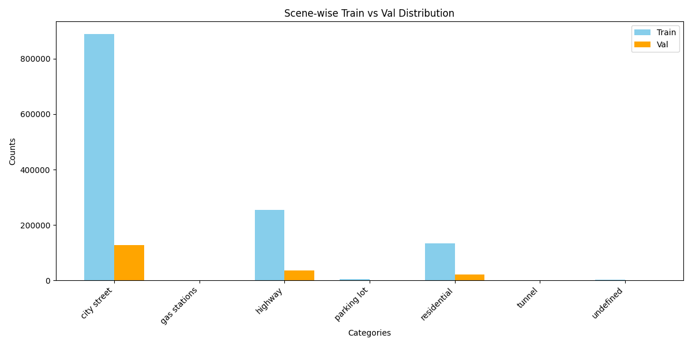
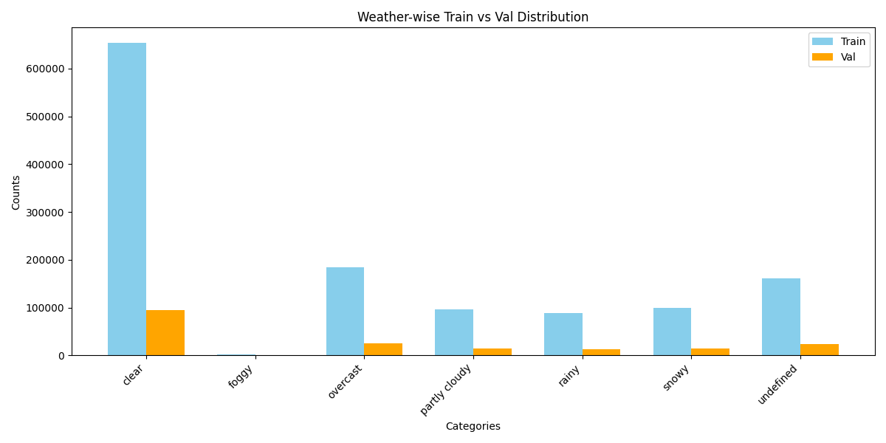
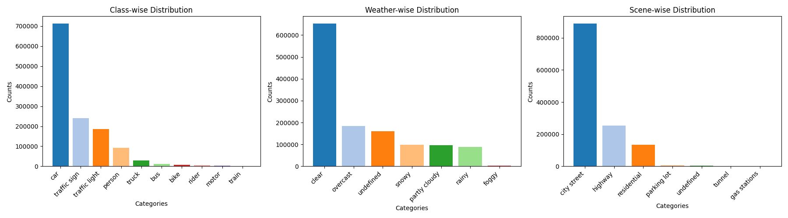
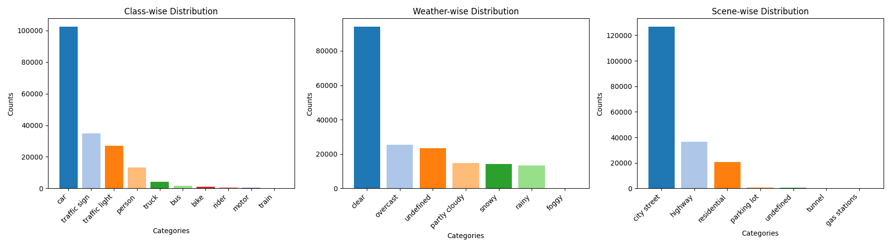
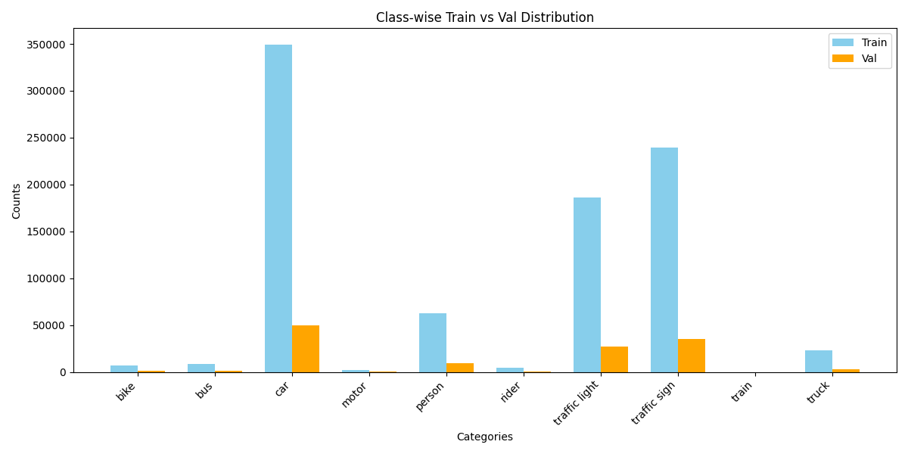
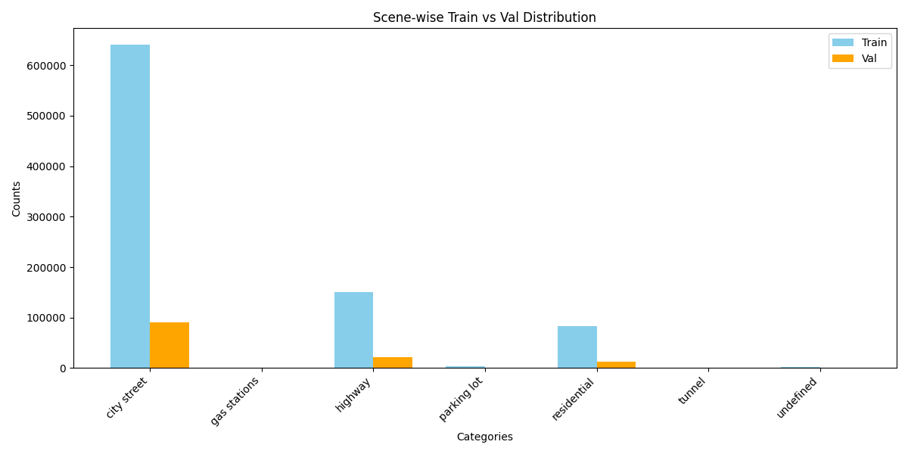
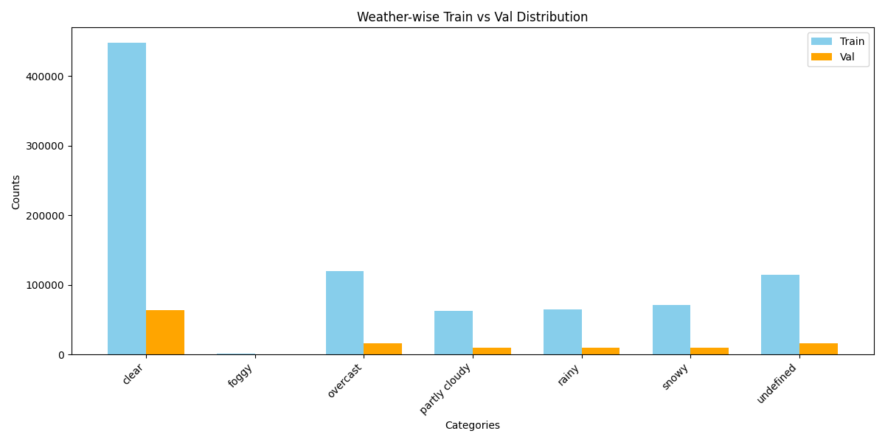
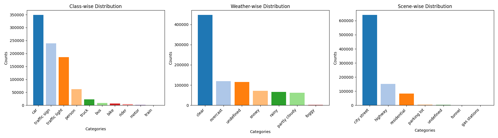
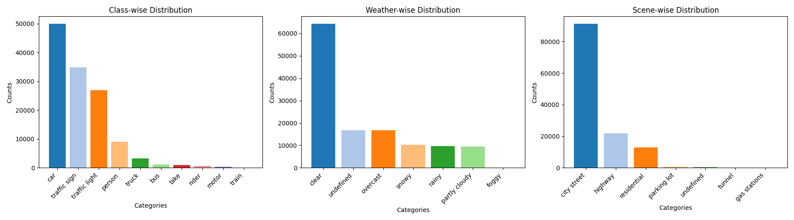

# Basic Insights About the Dataset

This document provides visual insights into the **BDD100K dataset** based on the processed statistics.  
The following charts highlight distributions across classes, scenarios, weather conditions, and splits.

---

## Overall Distributions

### Class-wise Distribution (Train vs Validation)

### Scenario-wise Distribution (Train vs Validation)

### Weather-wise Distribution (Train vs Validation)

---

## Combined Distributions

### Train Set Combined Distributions

### Validation Set Combined Distributions

---

## Filtered Distributions

Filtered results highlight refined insights after applying dataset filtering strategies.

### Class-wise Distribution (Filtered, Train vs Validation)

### Scenario-wise Distribution (Filtered, Train vs Validation)

### Weather-wise Distribution (Filtered, Train vs Validation)

### Train Set Combined Distributions (Filtered)

### Validation Set Combined Distributions (Filtered)

---

## Notes

- All charts are generated from the processed BDD100K dataset.
- Filtered distributions correspond to subsets where additional selection rules were applied.
- These insights are useful for understanding dataset balance and potential biases.

