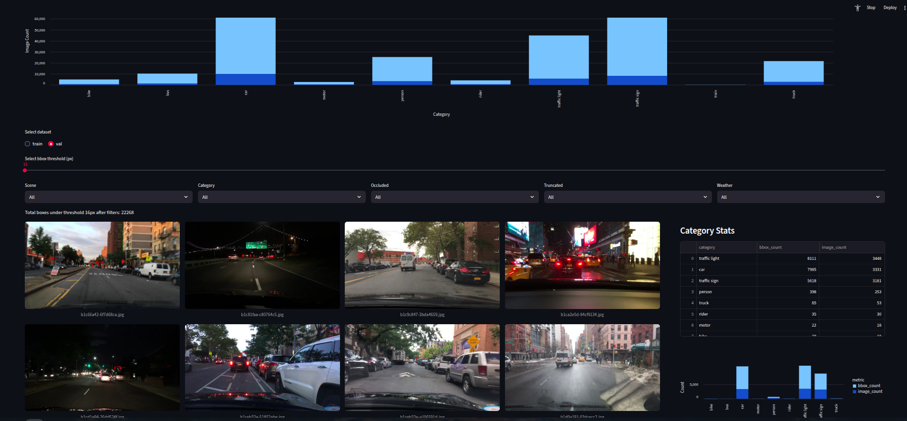

# Dataset Visualization Dashboard

This document describes the interactive **Streamlit dashboard** implemented in `run_viz.py`.  
The dashboard enables users to explore the **BDD100K dataset** after preprocessing and filtering.  

An example of the dashboard interface:  


---

## Capabilities of the Dashboard

The dashboard is designed to provide insights into dataset quality, balance, and anomalies.  
Here are the main features it supports:

### 1. Category Distribution Analysis
- Compare the number of bounding boxes and images per **category** across the **train** and **validation** splits.  
- Quickly identify class imbalance (e.g., many vehicles vs fewer pedestrians).  
- Useful for planning balanced training strategies.

---

### 2. Bounding Box Size Filtering
- Apply a bounding box **pixel threshold** to detect very small objects (e.g., pedestrians smaller than 16px).  
- Helps reveal low-quality annotations or extremely small instances that may not contribute effectively to model training.

---

### 3. Contextual Attribute Filtering
- Filter data based on attributes such as:  
  - **Scene** (city, residential, highway, etc.)  
  - **Weather** (clear, rainy, snowy, etc.)  
  - **Occlusion** (partially hidden objects)  
  - **Truncation** (objects cut off at image borders)  
- Enables deeper analysis of dataset biases and condition-specific object distributions.

---

### 4. Category-Level Statistics on Filtered Data
- For the filtered subset of data, the dashboard computes:  
  - **Bounding box counts per category**  
  - **Unique image counts per category**  
- This helps understand which classes are disproportionately affected by filtering criteria (e.g., motorcycles or traffic lights being too small).

---

### 5. Interactive Image Visualization
- Displays sample images with **bounding boxes drawn** for the filtered annotations.  
- Enables manual inspection of anomalies such as:  
  - Incorrect bounding boxes  
  - Missing annotations  
  - Mislabeled categories  
- Provides a visual check alongside statistical charts.

---

## Usage

1. Start the Streamlit app inside the container:
   ```bash
   streamlit run run_viz.py --server.port 8501 --server.address 0.0.0.0


2. Open the dashboard in your browser at:

```http://localhost:8501```


3. Explore the dataset by adjusting filters and thresholds to uncover dataset characteristics and potential issues.